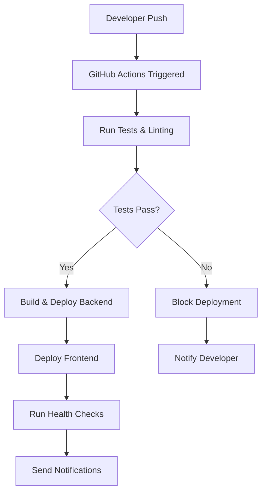

# 🔄 CI/CD Pipeline Documentation

## 📋 Overview

This document outlines our Continuous Integration and Continuous Deployment (CI/CD) pipeline using **GitHub Actions** for automated testing, building, and deployment to **Cloudflare Pages** and **Google Cloud Run**.

## 🎯 Pipeline Goals

- ✅ **Automated Testing** - Run unit and integration tests on every PR
- ✅ **Code Quality** - Lint, format, and security checks
- ✅ **Safe Deployments** - Deploy only after tests pass
- ✅ **Branch Protection** - Prevent direct pushes to main
- ✅ **Rollback Capability** - Quick rollback on deployment issues
- ✅ **Performance Monitoring** - Track deployment health

## 🌊 Workflow Overview



## 📁 Workflow Files Structure

```
.github/
└── workflows/
    ├── test.yml              # Run tests on PRs
    ├── deploy-backend.yml    # Deploy API to Cloud Run
    ├── deploy-frontend.yml   # Deploy to Cloudflare Pages
    ├── security-scan.yml     # Security and vulnerability checks
    └── cleanup.yml           # Clean up old deployments
```

## 🧪 Test Workflow

```yaml
# .github/workflows/test.yml
name: 🧪 Test Suite

on:
  pull_request:
    branches: [main, develop]
  push:
    branches: [main, develop]

env:
  NODE_VERSION: '18'
  CACHE_PREFIX: v1

jobs:
  test:
    name: 🏃‍♂️ Run Tests
    runs-on: ubuntu-latest
    timeout-minutes: 10
    
    steps:
      - name: 📥 Checkout code
        uses: actions/checkout@v4
        
      - name: 📦 Setup Node.js
        uses: actions/setup-node@v4
        with:
          node-version: ${{ env.NODE_VERSION }}
          cache: 'npm'
          
      - name: 📥 Install dependencies
        run: npm ci
        
      - name: 🔍 Run ESLint
        run: npm run lint
        
      - name: 🎨 Check Prettier formatting
        run: npm run format:check
        
      - name: 🧪 Run unit tests
        run: npm run test:unit
        
      - name: 🔗 Run integration tests
        run: npm run test:integration
        env:
          NODE_ENV: test
          
      - name: 📊 Generate test coverage
        run: npm run test:coverage
        
      - name: 📈 Upload coverage to Codecov
        uses: codecov/codecov-action@v3
        with:
          file: ./coverage/lcov.info
          fail_ci_if_error: false

  type-check:
    name: 🔍 TypeScript Check
    runs-on: ubuntu-latest
    timeout-minutes: 5
    
    steps:
      - uses: actions/checkout@v4
      - uses: actions/setup-node@v4
        with:
          node-version: ${{ env.NODE_VERSION }}
          cache: 'npm'
      - run: npm ci
      - run: npm run type-check

  security-audit:
    name: 🔒 Security Audit
    runs-on: ubuntu-latest
    timeout-minutes: 5
    
    steps:
      - uses: actions/checkout@v4
      - uses: actions/setup-node@v4
        with:
          node-version: ${{ env.NODE_VERSION }}
          cache: 'npm'
      - run: npm audit --audit-level=high
      - run: npm run security-scan
```

## 🚀 Backend Deployment Workflow

```yaml
# .github/workflows/deploy-backend.yml
name: 🚀 Deploy Backend to Cloud Run

on:
  push:
    branches: [main]
    paths: 
      - 'backend/**'
      - 'services/**'
      - 'utils/**'
      - 'routes/**'
      - 'server.js'
      - 'package*.json'
      - '.github/workflows/deploy-backend.yml'

env:
  GCP_PROJECT_ID: ${{ secrets.GCP_PROJECT_ID }}
  GCP_REGION: europe-north1
  SERVICE_NAME: seo-audit-api
  NODE_VERSION: '18'

jobs:
  test:
    name: 🧪 Run Tests
    runs-on: ubuntu-latest
    timeout-minutes: 10
    
    steps:
      - uses: actions/checkout@v4
      - uses: actions/setup-node@v4
        with:
          node-version: ${{ env.NODE_VERSION }}
          cache: 'npm'
      - run: npm ci
      - run: npm run test
      - run: npm run lint

  build-and-deploy:
    name: 🏗️ Build & Deploy
    needs: test
    runs-on: ubuntu-latest
    timeout-minutes: 20
    
    steps:
      - name: 📥 Checkout code
        uses: actions/checkout@v4
        
      - name: 🔐 Authenticate to Google Cloud
        uses: google-github-actions/auth@v2
        with:
          credentials_json: ${{ secrets.GCP_SA_KEY }}
          
      - name: ☁️ Setup Google Cloud SDK
        uses: google-github-actions/setup-gcloud@v2
        with:
          project_id: ${{ env.GCP_PROJECT_ID }}
          
      - name: 🐳 Configure Docker
        run: gcloud auth configure-docker
        
      - name: 📊 Pre-deployment health check
        id: pre_deploy
        run: |
          echo "deployment_time=$(date -u +%Y-%m-%dT%H:%M:%SZ)" >> $GITHUB_OUTPUT
          echo "git_sha=${{ github.sha }}" >> $GITHUB_OUTPUT
          echo "git_ref=${{ github.ref_name }}" >> $GITHUB_OUTPUT
          
      - name: 🚀 Deploy to Cloud Run
        id: deploy
        run: |
          gcloud run deploy $SERVICE_NAME \
            --source . \
            --project=$GCP_PROJECT_ID \
            --region=$GCP_REGION \
            --allow-unauthenticated \
            --port=8080 \
            --timeout=900s \
            --memory=2Gi \
            --cpu=2 \
            --concurrency=10 \
            --min-instances=0 \
            --max-instances=100 \
            --execution-environment=gen2 \
            --set-env-vars="NODE_ENV=production,DEPLOYMENT_TIME=${{ steps.pre_deploy.outputs.deployment_time }},GIT_SHA=${{ steps.pre_deploy.outputs.git_sha }}" \
            --set-secrets="API_KEYS=/secrets/api-keys:latest" \
            --labels="app=seo-audit,environment=production,deployed-by=github-actions" \
            --tag="sha-${{ github.sha }}" \
            --no-traffic
            
      - name: 🌐 Get service URL
        id: service_url
        run: |
          SERVICE_URL=$(gcloud run services describe $SERVICE_NAME \
            --region=$GCP_REGION \
            --project=$GCP_PROJECT_ID \
            --format="value(status.url)")
          echo "service_url=$SERVICE_URL" >> $GITHUB_OUTPUT
          echo "🌐 Service URL: $SERVICE_URL"
          
      - name: 🔍 Health check new deployment
        run: |
          # Wait for service to be ready
          sleep 30
          
          # Test health endpoint
          curl -f ${{ steps.service_url.outputs.service_url }}/health \
            -H "Accept: application/json" \
            --max-time 30 \
            --retry 5 \
            --retry-delay 10
            
      - name: ✅ Route traffic to new version
        run: |
          gcloud run services update-traffic $SERVICE_NAME \
            --region=$GCP_REGION \
            --project=$GCP_PROJECT_ID \
            --to-latest
            
      - name: 📊 Post-deployment verification
        run: |
          # Test key endpoints
          echo "Testing audit endpoint..."
          curl -f ${{ steps.service_url.outputs.service_url }}/api/health \
            --max-time 10
            
          echo "✅ Deployment verification completed"
          
      - name: 🧹 Cleanup old revisions
        run: |
          # Keep only the latest 5 revisions
          gcloud run revisions list \
            --service=$SERVICE_NAME \
            --region=$GCP_REGION \
            --project=$GCP_PROJECT_ID \
            --format="value(metadata.name)" \
            --sort-by="~metadata.creationTimestamp" \
            --limit=100 | tail -n +6 | \
          while read revision; do
            echo "Deleting old revision: $revision"
            gcloud run revisions delete $revision \
              --region=$GCP_REGION \
              --project=$GCP_PROJECT_ID \
              --quiet
          done

  notify:
    name: 📢 Notify Team
    needs: [build-and-deploy]
    runs-on: ubuntu-latest
    if: always()
    
    steps:
      - name: 📱 Send Slack notification
        if: ${{ secrets.SLACK_WEBHOOK }}
        uses: 8398a7/action-slack@v3
        with:
          status: ${{ job.status }}
          channel: '#deployments'
          text: |
            Backend deployment ${{ job.status }}!
            Service: ${{ env.SERVICE_NAME }}
            Region: ${{ env.GCP_REGION }}
            Commit: ${{ github.sha }}
        env:
          SLACK_WEBHOOK_URL: ${{ secrets.SLACK_WEBHOOK }}
```

## 🌐 Frontend Deployment Workflow

```yaml
# .github/workflows/deploy-frontend.yml
name: 🌐 Deploy Frontend to Cloudflare Pages

on:
  push:
    branches: [main]
    paths:
      - 'frontend/**'
      - 'index.html'
      - 'assets/**'
      - '.github/workflows/deploy-frontend.yml'

env:
  NODE_VERSION: '18'

jobs:
  test-frontend:
    name: 🧪 Test Frontend
    runs-on: ubuntu-latest
    timeout-minutes: 10
    
    steps:
      - uses: actions/checkout@v4
      - uses: actions/setup-node@v4
        with:
          node-version: ${{ env.NODE_VERSION }}
          cache: 'npm'
      - run: npm ci
      - run: npm run test:frontend
      - run: npm run lint:frontend

  build-and-deploy:
    name: 🏗️ Build & Deploy Frontend
    needs: test-frontend
    runs-on: ubuntu-latest
    timeout-minutes: 10
    
    steps:
      - name: 📥 Checkout code
        uses: actions/checkout@v4
        
      - name: 📦 Setup Node.js
        uses: actions/setup-node@v4
        with:
          node-version: ${{ env.NODE_VERSION }}
          cache: 'npm'
          
      - name: 📥 Install dependencies
        run: npm ci
        
      - name: 🏗️ Build frontend assets
        run: |
          npm run build:frontend
          # Optimize images, minify CSS/JS, generate service worker
          
      - name: 🚀 Deploy to Cloudflare Pages
        uses: cloudflare/pages-action@v1
        with:
          apiToken: ${{ secrets.CLOUDFLARE_API_TOKEN }}
          accountId: ${{ secrets.CLOUDFLARE_ACCOUNT_ID }}
          projectName: seo-audit-frontend
          directory: frontend
          gitHubToken: ${{ secrets.GITHUB_TOKEN }}
          wranglerVersion: '3'
          
      - name: 🔥 Purge Cloudflare Cache
        uses: jakejarvis/cloudflare-purge-action@master
        env:
          CLOUDFLARE_ZONE: ${{ secrets.CLOUDFLARE_ZONE }}
          CLOUDFLARE_TOKEN: ${{ secrets.CLOUDFLARE_TOKEN }}
          
      - name: 🔍 Test deployed frontend
        run: |
          sleep 30  # Wait for propagation
          
          # Test main page loads
          curl -f https://seo-audit.yourdomain.com \
            --max-time 10
            
          # Test API proxy works
          curl -f https://seo-audit.yourdomain.com/api/health \
            --max-time 15
            
          echo "✅ Frontend deployment verification completed"

  performance-audit:
    name: 📊 Performance Audit
    needs: build-and-deploy
    runs-on: ubuntu-latest
    timeout-minutes: 5
    
    steps:
      - name: 🚤 Lighthouse CI
        uses: treosh/lighthouse-ci-action@v10
        with:
          urls: |
            https://seo-audit.yourdomain.com
          configPath: '.lighthouserc.json'
          uploadArtifacts: true
          temporaryPublicStorage: true
```

## 🔒 Security Scanning Workflow

```yaml
# .github/workflows/security-scan.yml
name: 🔒 Security Scan

on:
  schedule:
    - cron: '0 2 * * 1'  # Weekly on Monday at 2 AM
  workflow_dispatch:     # Manual trigger

jobs:
  dependency-scan:
    name: 🔍 Dependency Vulnerability Scan
    runs-on: ubuntu-latest
    
    steps:
      - uses: actions/checkout@v4
      - uses: actions/setup-node@v4
        with:
          node-version: '18'
          cache: 'npm'
      - run: npm ci
      - run: npm audit --audit-level=moderate
      
      - name: 🔒 Snyk Security Scan
        uses: snyk/actions/node@master
        env:
          SNYK_TOKEN: ${{ secrets.SNYK_TOKEN }}
        with:
          args: --severity-threshold=high

  dockerfile-scan:
    name: 🐳 Dockerfile Security Scan
    runs-on: ubuntu-latest
    
    steps:
      - uses: actions/checkout@v4
      - name: 🔍 Run Trivy vulnerability scanner
        uses: aquasecurity/trivy-action@master
        with:
          scan-type: 'fs'
          scan-ref: '.'
          format: 'sarif'
          output: 'trivy-results.sarif'
          
      - name: 📊 Upload Trivy scan results
        uses: github/codeql-action/upload-sarif@v3
        if: always()
        with:
          sarif_file: 'trivy-results.sarif'
```

## 🧹 Cleanup Workflow

```yaml
# .github/workflows/cleanup.yml
name: 🧹 Cleanup

on:
  schedule:
    - cron: '0 3 * * 0'  # Weekly on Sunday at 3 AM
  workflow_dispatch:

jobs:
  cleanup-cloud-run:
    name: 🧹 Cleanup Old Cloud Run Revisions
    runs-on: ubuntu-latest
    
    steps:
      - name: 🔐 Authenticate to Google Cloud
        uses: google-github-actions/auth@v2
        with:
          credentials_json: ${{ secrets.GCP_SA_KEY }}
          
      - name: ☁️ Setup Google Cloud SDK
        uses: google-github-actions/setup-gcloud@v2
        
      - name: 🧹 Delete old revisions
        run: |
          # Keep only latest 10 revisions for rollback capability
          gcloud run revisions list \
            --service=seo-audit-api \
            --region=europe-north1 \
            --project=${{ secrets.GCP_PROJECT_ID }} \
            --format="value(metadata.name)" \
            --sort-by="~metadata.creationTimestamp" \
            --limit=100 | tail -n +11 | \
          while read revision; do
            echo "Deleting old revision: $revision"
            gcloud run revisions delete $revision \
              --region=europe-north1 \
              --project=${{ secrets.GCP_PROJECT_ID }} \
              --quiet
          done

  cleanup-artifacts:
    name: 🧹 Cleanup Build Artifacts
    runs-on: ubuntu-latest
    
    steps:
      - name: 🗑️ Delete old workflow runs
        uses: Mattraks/delete-workflow-runs@v2
        with:
          token: ${{ github.token }}
          repository: ${{ github.repository }}
          retain_days: 30
          keep_minimum_runs: 10
```

## 📊 Monitoring and Alerting

### GitHub Repository Settings

```yaml
# .github/branch-protection-rules.yml
branches:
  main:
    protection_rules:
      required_status_checks:
        strict: true
        checks:
          - "🧪 Run Tests"
          - "🔍 TypeScript Check"
          - "🔒 Security Audit"
      enforce_admins: false
      required_pull_request_reviews:
        required_approving_review_count: 1
        dismiss_stale_reviews: true
        require_code_owner_reviews: true
      restrictions: null
```

### Status Check Configuration

```json
// .lighthouserc.json
{
  "ci": {
    "collect": {
      "numberOfRuns": 3,
      "url": ["https://seo-audit.yourdomain.com"]
    },
    "assert": {
      "assertions": {
        "categories:performance": ["error", {"minScore": 0.8}],
        "categories:accessibility": ["error", {"minScore": 0.9}],
        "categories:best-practices": ["error", {"minScore": 0.8}],
        "categories:seo": ["error", {"minScore": 0.9}]
      }
    },
    "upload": {
      "target": "temporary-public-storage"
    }
  }
}
```

## 🚦 Environment Management

### Secrets Configuration

Required GitHub Secrets:

```bash
# Google Cloud Platform
GCP_PROJECT_ID=your-gcp-project-id
GCP_SA_KEY={"type":"service_account",...}  # Service Account JSON

# Cloudflare
CLOUDFLARE_API_TOKEN=your-cloudflare-api-token
CLOUDFLARE_ACCOUNT_ID=your-account-id
CLOUDFLARE_ZONE=your-zone-id

# Optional: Notifications
SLACK_WEBHOOK=https://hooks.slack.com/services/...
DISCORD_WEBHOOK=https://discord.com/api/webhooks/...

# Optional: Security Scanning
SNYK_TOKEN=your-snyk-token
SONAR_TOKEN=your-sonarcloud-token
```

### Environment Variables per Environment

```yaml
# Production Environment
production:
  NODE_ENV: production
  LOG_LEVEL: info
  ENABLE_METRICS: true
  MAX_CONCURRENT_AUDITS: 10
  CACHE_TTL: 3600

# Staging Environment  
staging:
  NODE_ENV: staging
  LOG_LEVEL: debug
  ENABLE_METRICS: true
  MAX_CONCURRENT_AUDITS: 5
  CACHE_TTL: 1800
```

## 🔄 Rollback Strategy

### Automatic Rollback

```yaml
# Add to deploy-backend.yml
- name: 🔄 Rollback on health check failure
  if: failure()
  run: |
    echo "Health check failed, rolling back..."
    
    # Get previous stable revision
    PREVIOUS_REVISION=$(gcloud run revisions list \
      --service=$SERVICE_NAME \
      --region=$GCP_REGION \
      --project=$GCP_PROJECT_ID \
      --format="value(metadata.name)" \
      --sort-by="~metadata.creationTimestamp" \
      --limit=2 | tail -n 1)
    
    # Route traffic back to previous revision
    gcloud run services update-traffic $SERVICE_NAME \
      --region=$GCP_REGION \
      --project=$GCP_PROJECT_ID \
      --to-revisions=$PREVIOUS_REVISION=100
    
    echo "Rolled back to revision: $PREVIOUS_REVISION"
```

### Manual Rollback

```bash
# List recent revisions
gcloud run revisions list \
  --service=seo-audit-api \
  --region=europe-north1

# Rollback to specific revision
gcloud run services update-traffic seo-audit-api \
  --region=europe-north1 \
  --to-revisions=seo-audit-api-00042-xyz=100
```

## 📈 Performance Metrics

### Key Metrics to Track

1. **Deployment Success Rate** - % of successful deployments
2. **Deployment Duration** - Time from push to live
3. **Rollback Frequency** - How often rollbacks are needed
4. **Test Coverage** - % of code covered by tests
5. **Security Vulnerabilities** - Number of critical/high issues

### Dashboard Setup

```yaml
# GitHub Actions dashboard metrics
name: 📊 Deployment Metrics
on:
  workflow_run:
    workflows: ["🚀 Deploy Backend to Cloud Run"]
    types: [completed]

jobs:
  metrics:
    runs-on: ubuntu-latest
    steps:
      - name: 📊 Track deployment metrics
        run: |
          # Send metrics to monitoring system
          curl -X POST "${{ secrets.METRICS_ENDPOINT }}" \
            -H "Content-Type: application/json" \
            -d '{
              "deployment_status": "${{ github.event.workflow_run.conclusion }}",
              "deployment_time": "${{ github.event.workflow_run.updated_at }}",
              "service": "seo-audit-api",
              "commit_sha": "${{ github.event.workflow_run.head_sha }}"
            }'
```

## 🎯 Best Practices

### 1. **Fast Feedback Loop**
- Tests complete in <10 minutes
- Deployments complete in <20 minutes
- Immediate notification on failures

### 2. **Safe Deployments**
- Blue-green deployments with health checks
- Automatic rollback on failure
- Traffic gradual shifting capability

### 3. **Security First**
- No secrets in code
- Regular dependency scanning
- Container vulnerability scanning

### 4. **Monitoring & Observability**
- Comprehensive logging
- Performance tracking
- Error alerting

### 5. **Documentation**
- Clear workflow documentation
- Runbook for common issues
- Architecture decision records

## 🚨 Troubleshooting Guide

### Common Issues & Solutions

1. **Deploy fails with "Service not found"**
   ```bash
   # Ensure service exists or create it first
   gcloud run deploy seo-audit-api --source . --region=europe-north1
   ```

2. **Health check timeouts**
   ```bash
   # Increase Cloud Run timeout and check health endpoint
   gcloud run services update seo-audit-api --timeout=900s
   ```

3. **Memory errors during build**
   ```bash
   # Increase memory allocation
   gcloud run deploy --memory=4Gi
   ```

4. **Permission denied errors**
   ```bash
   # Check service account permissions
   gcloud projects get-iam-policy $PROJECT_ID
   ```

---

**Next Steps**: See [Build Configuration](build-configuration.md) for detailed build setup instructions.